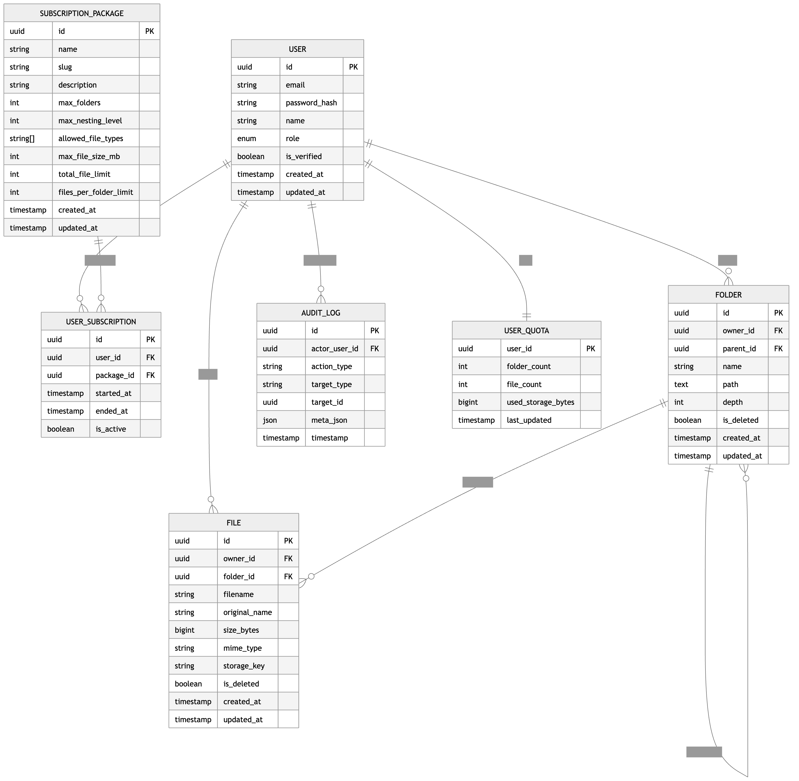

# Tiered File System API

Backend API for a subscription-based file system SaaS using **Express + TypeScript + Prisma + PostgreSQL**.

## Overview

This API provides:

- JWT-based authentication with role-based access control (`ADMIN`, `USER`)
- Subscription package definitions and package enrollment
- Folder hierarchy and file management with package-enforced limits
- Admin portal APIs for users, dashboard stats, enrollment history, and audit logs
- Swagger/OpenAPI docs for public and admin endpoints

## Tech Stack

- **Runtime**: Node.js
- **Framework**: Express
- **Language**: TypeScript
- **ORM**: Prisma
- **Database**: PostgreSQL
- **Validation**: Zod
- **Auth**: JWT (access + refresh)
- **File Upload**: Multer + Cloudinary (optional cloud settings)

## ERD

#file:erd.png



## Project Structure

Key folders:

- `src/features/auth` → register/login/profile/email verification/password reset
- `src/features/packages` → package list and admin package CRUD
- `src/features/subscriptions` → activate package + user history
- `src/features/folders` → folder CRUD for user workspace
- `src/features/files` → upload/list/rename/delete file APIs
- `src/features/admin` → admin portal APIs (users, stats, enrollments, audit logs)
- `src/features/audit` → reusable audit logging service/repository
- `prisma/` → schema, migrations, seed

## Environment Variables

Create `.env` from `.env.example` and set these values:

- `NODE_ENV` (`development | test | production`)
- `PORT` (default `5001`)
- `VERSION`
- `DATABASE_URL`
- `ALLOWED_ORIGINS` (comma-separated)
- `JWT_ACCESS_SECRET`
- `JWT_REFRESH_SECRET`
- `JWT_ACCESS_EXPIRES_IN` (default `15m`)
- `JWT_REFRESH_EXPIRES_IN` (default `30d`)
- `DEFAULT_ADMIN_EMAIL`
- `DEFAULT_ADMIN_PASSWORD`
- `CLOUDINARY_CLOUD_NAME` (optional)
- `CLOUDINARY_API_KEY` (optional)
- `CLOUDINARY_API_SECRET` (optional)

## Setup & Run

1. Install dependencies

```bash
npm install
```

2. Create env file

```bash
cp .env.example .env
```

3. Generate Prisma client and run migration

```bash
npx prisma generate
npx prisma migrate dev --name init
```

4. Seed initial data (including default admin)

```bash
npm run prisma:seed
```

5. Start development server

```bash
npm run dev
```

## Scripts

- `npm run dev` → run local dev server
- `npm run build` → compile TypeScript to `dist`
- `npm run start` → run compiled app
- `npm run typecheck` → validate TypeScript types
- `npm run prisma:generate` → generate Prisma client
- `npm run prisma:migrate` → run Prisma dev migration
- `npm run prisma:deploy` → apply migrations in deploy mode
- `npm run prisma:seed` / `npm run seed` → seed database

## API Base & Docs

- Base URL: `http://localhost:5001/api/v1`
- Health: `GET /health`
- Swagger UI: `GET /docs`

## Authentication

Use Bearer token in `Authorization` header:

```http
Authorization: Bearer <access_token>
```

RBAC:

- `USER` → user workspace APIs
- `ADMIN` → admin APIs and package administration

## Endpoint Summary

### Auth

- `POST /api/v1/auth/register`
- `POST /api/v1/auth/login`
- `GET /api/v1/auth/me`
- `POST /api/v1/auth/verify-email/resend`
- `POST /api/v1/auth/verify-email`
- `POST /api/v1/auth/forgot-password`
- `POST /api/v1/auth/reset-password`

### Packages

- `GET /api/v1/packages` (public)
- `POST /api/v1/admin/packages` (admin)
- `PUT /api/v1/admin/packages/:id` (admin)
- `DELETE /api/v1/admin/packages/:id` (admin)

### Subscriptions

- `POST /api/v1/subscriptions/activate`
- `GET /api/v1/subscriptions/me`

### Folders

- `GET /api/v1/folders`
- `POST /api/v1/folders`
- `PATCH /api/v1/folders/:id`
- `DELETE /api/v1/folders/:id`

### Files

- `GET /api/v1/files`
- `POST /api/v1/files` (multipart)
- `PATCH /api/v1/files/:id`
- `DELETE /api/v1/files/:id`

### Admin Portal APIs

- `GET /api/v1/admin/users`
- `GET /api/v1/admin/subscriptions/enrollments`
- `GET /api/v1/admin/dashboard/stats`
- `GET /api/v1/admin/audit-logs`

## Admin Dashboard Data Contract

`GET /api/v1/admin/dashboard/stats` returns:

- `totalUsers`
- `totalVerifiedUsers`
- `totalPackages`
- `activeSubscriptions`
- `totalFiles`
- `totalFolders`
- `totalStorageBytes`

## Audit Logging

The system stores audit entries in `audit_logs`.

Currently tracked admin package events:

- `PACKAGE_CREATED`
- `PACKAGE_UPDATED`
- `PACKAGE_DELETED`

Each record includes actor, target, action type, timestamp, and metadata.

## Error Response Shape

Standard error format:

```json
{
  "success": false,
  "code": "ERROR_CODE",
  "message": "Human readable message",
  "details": null
}
```

## Production Notes

- Set strong JWT secrets and rotate periodically
- Restrict `ALLOWED_ORIGINS` to trusted domains
- Use `NODE_ENV=production`
- Run `npm run build` and `npm run start`
- Apply migrations using `npm run prisma:deploy`

## License

This project is licensed under the terms of the `LICENSE` file.

